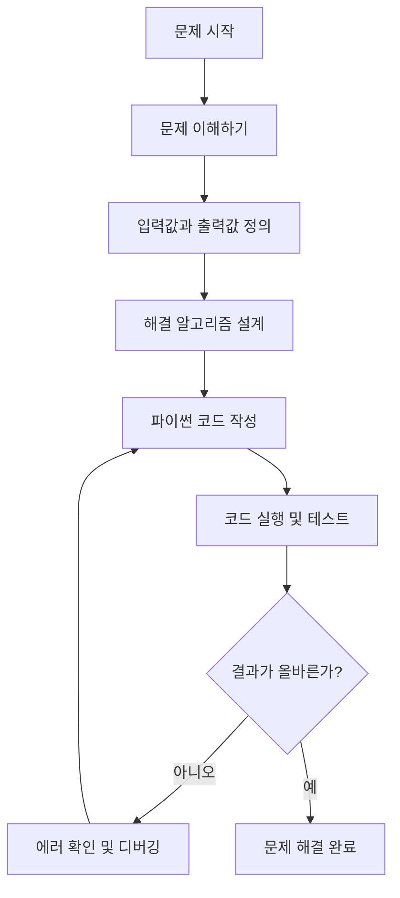

#
# 교육 환경 설정 및 간단한 파이썬 연습 코드
# [실습3] Mermaid 다이어그램
#
# 작성일 : 2026-07-06
# 작성자 : 백정열, SKALA
#
# 변경일 : 
#
# All Rights Reserved by SK AX, SKALA
#

## Mermaid란?

Mermaid는 텍스트(코드) 기반으로 순서도, 클래스 다이어그램, 시퀀스 다이어그램 등
다양한 다이어그램을 그릴 수 있는 마크다운 스타일의 다이어그래밍 도구입니다.
별도의 그래픽 툴 없이 간단한 문법으로 코드를 작성하면 자동으로 시각화된
다이어그램으로 렌더링됩니다. https://mermaid.live 에서 바로 편집하고 미리볼 수 있습니다.

## Mermaid 차트 종류

| 차트 종류 | 용도 | 문법 시작 키워드 |
|---|---|---|
| 순서도 (Flowchart) | 프로세스, 알고리즘 흐름 표현 | `flowchart` / `graph` |
| 시퀀스 다이어그램 (Sequence) | 객체 간 상호작용 순서 표현 | `sequenceDiagram` |
| 클래스 다이어그램 (Class) | 클래스 구조 및 관계 표현 | `classDiagram` |
| 상태 다이어그램 (State) | 상태 전이 표현 | `stateDiagram-v2` |
| ER 다이어그램 (Entity Relationship) | 데이터베이스 테이블 관계 표현 | `erDiagram` |
| 간트 차트 (Gantt) | 프로젝트 일정 표현 | `gantt` |
| 파이 차트 (Pie) | 비율 데이터 표현 | `pie` |

## 예제: 파이썬 코드 문제 해결 순서도

아래 코드를 https://mermaid.live/edit 에 붙여넣으면 순서도를 확인할 수 있습니다.
(파일: flowchart_example.mmd)

